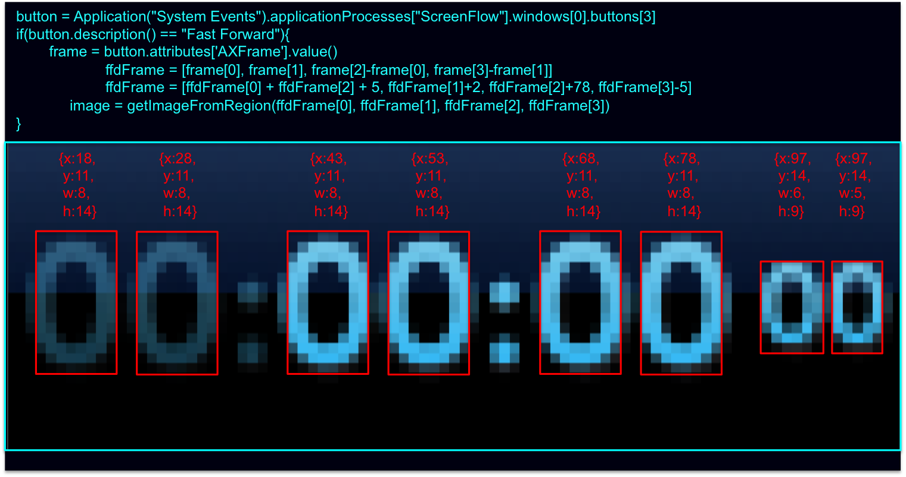
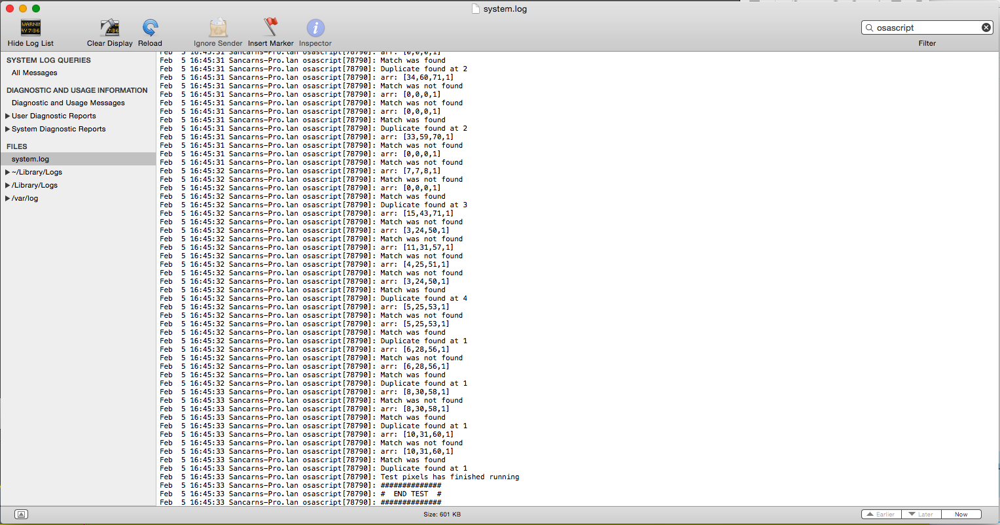

# Theory


# Method:

1. Get individual pictures specific to each TimeStamp state.
2. Check all pixels of all images, and find unique pixel color values.

### Step 1

To complete step 1 we use `grabSourcePictures.jxa`

This script contains 3 sub-scripts (at the bottom).
Each sub-script extracts a different image from ScreenFlow
The scripts will dump the pictures to "/Users/Sancarn/Pictures/... ". Change this file path as needed.

### Step 2

To complete step 2 we use the `testPixelsOfImage.jxa` script.

This script runs over a region specified by a variable named BoundingBox:

```
var BoundingBox = {x:97,y:14,w:5,h:9}
```

The properties x,y,w and h are calculated manually by zooming inot the picture with Preview.

The images to check over is defined by the `imagePaths` array. This will be the path of all 'state changes' and will be an array of file paths. E.G.

```
var imagePaths = [
    "/Users/Sancarn/Pictures/TimeCodeFrame00.png",
    "/Users/Sancarn/Pictures/TimeCodeFrame10.png",
    "/Users/Sancarn/Pictures/TimeCodeFrame20.png"
]
```

After these 2 variables are set up, run the script.

All information discovered will be found in the [Console Application window](https://computers.tutsplus.com/tutorials/how-to-use-console-your-macs-diagnostic-diary--mac-45251). E.G.

```
Feb  5 16:45:10 Sancarns-Pro.lan osascript[78790]: ##############
Feb  5 16:45:10 Sancarns-Pro.lan osascript[78790]: # START TEST #
Feb  5 16:45:10 Sancarns-Pro.lan osascript[78790]: ##############
Feb  5 16:45:10 Sancarns-Pro.lan osascript[78790]: arr: [54,149,188,1]
Feb  5 16:45:10 Sancarns-Pro.lan osascript[78790]: Match was not found
Feb  5 16:45:10 Sancarns-Pro.lan osascript[78790]: arr: [0,0,0,1]
Feb  5 16:45:10 Sancarns-Pro.lan osascript[78790]: Match was not found
Feb  5 16:45:10 Sancarns-Pro.lan osascript[78790]: arr: [62,170,213,1]
Feb  5 16:45:10 Sancarns-Pro.lan osascript[78790]: Match was not found
Feb  5 16:45:10 Sancarns-Pro.lan osascript[78790]: arr: [42,120,151,1]
Feb  5 16:45:10 Sancarns-Pro.lan osascript[78790]: Match was not found
Feb  5 16:45:10 Sancarns-Pro.lan osascript[78790]: arr: [50,92,112,1]
Feb  5 16:45:10 Sancarns-Pro.lan osascript[78790]: Match was not found
Feb  5 16:45:11 Sancarns-Pro.lan osascript[78790]: arr: [41,120,152,1]
Feb  5 16:45:11 Sancarns-Pro.lan osascript[78790]: Match was not found
Feb  5 16:45:11 Sancarns-Pro.lan osascript[78790]: arr: [50,137,172,1]
Feb  5 16:45:11 Sancarns-Pro.lan osascript[78790]: Match was not found
Feb  5 16:45:11 Sancarns-Pro.lan osascript[78790]: arr: [66,189,238,1]
Feb  5 16:45:11 Sancarns-Pro.lan osascript[78790]: Match was not found
Feb  5 16:45:11 Sancarns-Pro.lan osascript[78790]: arr: [53,144,181,1]
Feb  5 16:45:11 Sancarns-Pro.lan osascript[78790]: Match was not found
Feb  5 16:45:11 Sancarns-Pro.lan osascript[78790]: arr: [17,51,64,1]
Feb  5 16:45:11 Sancarns-Pro.lan osascript[78790]: Match was not found
Feb  5 16:45:11 Sancarns-Pro.lan osascript[78790]: Distinguishable Pixel Success: [97,14] --> Values: [[54,149,188,1],[0,0,0,1],[62,170,213,1],[42,120,151,1],[50,92,112,1],[41,120,152,1],[50,137,172,1],[66,189,238,1],[53,144,181,1],[17,51,64,1]]
Feb  5 16:45:11 Sancarns-Pro.lan osascript[78790]: arr: [20,39,47,1]
Feb  5 16:45:11 Sancarns-Pro.lan osascript[78790]: Match was not found
Feb  5 16:45:11 Sancarns-Pro.lan osascript[78790]: arr: [0,0,0,1]

-EDIT: SNIP-

Feb  5 16:45:33 Sancarns-Pro.lan osascript[78790]: Duplicate found at 1
Feb  5 16:45:33 Sancarns-Pro.lan osascript[78790]: Test pixels has finished running
Feb  5 16:45:33 Sancarns-Pro.lan osascript[78790]: ##############
Feb  5 16:45:33 Sancarns-Pro.lan osascript[78790]: #  END TEST  #
Feb  5 16:45:33 Sancarns-Pro.lan osascript[78790]: ##############
```

Here we can analyse what the code is doing. To find Distinguishable Pixels, i.e. pixels we can check to determine the number, take the log contents and use a tool like regexr.com to get a list of the matches:

```
RegEx: Distinguishable Pixel Success.*
List: $&\n
```

this will return all distinguishable pixels with their location and state identities.

--------------------------------

A handy filter for Console.App is using "osascript":



# Distinguishable Pixels

## 1s frame digit:

I.E.

```
00:00:00:00
00:00:00:01
00:00:00:02
00:00:00:03
...
```


This has 10 states: 0, 1, 2, 3, 4, 5, 6, 7, 8, 9

16/45 pixels found to be unique over all states.

```
Distinguishable Pixel Success: [97,14] --> Values: [[54,149,188,1],[0,0,0,1],[62,170,213,1],[42,120,151,1],[50,92,112,1],[41,120,152,1],[50,137,172,1],[66,189,238,1],[53,144,181,1],[17,51,64,1]]
Distinguishable Pixel Success: [97,15] --> Values: [[20,39,47,1],[0,0,0,1],[71,184,228,1],[1,4,5,1],[68,175,217,1],[1,2,2,1],[28,40,47,1],[47,124,154,1],[40,65,78,1],[33,38,43,1]]
Distinguishable Pixel Success: [97,16] --> Values: [[11,11,12,1],[0,0,0,1],[19,48,59,1],[17,41,51,1],[51,86,103,1],[31,31,34,1],[59,112,133,1],[11,29,36,1],[68,153,187,1],[84,194,236,1]]
Distinguishable Pixel Success: [97,18] --> Values: [[47,78,106,1],[55,97,127,1],[45,73,100,1],[31,48,74,1],[90,179,217,1],[82,160,195,1],[104,198,235,1],[21,40,65,1],[71,138,171,1],[36,56,82,1]]
Distinguishable Pixel Success: [97,19] --> Values: [[90,170,204,1],[110,196,231,1],[95,176,211,1],[83,157,191,1],[32,78,110,1],[90,167,201,1],[66,135,168,1],[64,120,152,1],[88,165,199,1],[81,154,189,1]]
Distinguishable Pixel Success: [98,14] --> Values: [[23,69,87,1],[63,178,224,1],[46,89,108,1],[16,48,61,1],[51,109,134,1],[21,61,78,1],[20,59,76,1],[53,115,143,1],[23,68,86,1],[66,192,243,1]]
Distinguishable Pixel Success: [98,17] --> Values: [[0,0,0,1],[88,184,222,1],[19,45,54,1],[81,171,207,1],[42,67,80,1],[95,196,236,1],[94,194,234,1],[61,136,165,1],[82,174,210,1],[1,2,2,1]]
Distinguishable Pixel Success: [98,19] --> Values: [[62,115,145,1],[112,199,233,1],[60,110,140,1],[58,104,134,1],[114,202,235,1],[58,108,139,1],[111,197,230,1],[64,120,152,1],[54,94,123,1],[59,108,138,1]]
Distinguishable Pixel Success: [99,14] --> Values: [[57,163,207,1],[46,104,130,1],[23,64,82,1],[52,153,193,1],[66,192,243,1],[56,163,205,1],[50,146,185,1],[13,13,14,1],[54,158,199,1],[50,100,122,1]]
Distinguishable Pixel Success: [99,15] --> Values: [[25,67,83,1],[51,108,132,1],[37,41,45,1],[46,104,127,1],[74,194,241,1],[38,91,112,1],[17,44,56,1],[35,39,43,1],[38,87,108,1],[72,184,227,1]]
Distinguishable Pixel Success: [99,17] --> Values: [[13,31,37,1],[59,114,137,1],[89,187,224,1],[83,173,209,1],[95,197,237,1],[91,189,227,1],[91,191,230,1],[87,180,216,1],[89,186,224,1],[57,126,153,1]]
Distinguishable Pixel Success: [99,18] --> Values: [[51,101,133,1],[64,126,159,1],[62,125,160,1],[79,158,194,1],[104,200,237,1],[24,50,76,1],[16,37,64,1],[105,199,237,1],[77,155,191,1],[45,93,124,1]]
Distinguishable Pixel Success: [99,19] --> Values: [[101,184,218,1],[65,127,159,1],[94,174,208,1],[103,185,220,1],[114,202,235,1],[59,108,139,1],[43,72,101,1],[101,184,217,1],[100,182,216,1],[97,177,211,1]]
Distinguishable Pixel Success: [100,16] --> Values: [[83,195,240,1],[0,0,0,1],[31,36,40,1],[41,100,123,1],[32,55,65,1],[74,170,209,1],[81,190,233,1],[11,11,12,1],[57,132,163,1],[66,141,171,1]]
Distinguishable Pixel Success: [100,17] --> Values: [[96,197,238,1],[0,0,0,1],[73,143,173,1],[43,62,72,1],[33,56,67,1],[29,63,77,1],[39,83,103,1],[31,33,36,1],[46,67,79,1],[95,194,235,1]]
Distinguishable Pixel Success: [100,19] --> Values: [[90,169,204,1],[5,26,53,1],[102,188,222,1],[81,157,191,1],[37,74,104,1],[52,94,123,1],[7,28,55,1],[98,181,215,1],[85,163,197,1],[105,192,226,1]]
```


## 10s frame digit: 

I.E.

```
00:00:00:00
00:00:00:10
00:00:00:20
...
```

This has 3 states: 0, 1, 2

32/54 pixels found to be unique over all states.

```
Distinguishable Pixel Success: [90,14] --> Values: [[67,190,239,1],[0,0,0,1],[67,193,243,1]]
Distinguishable Pixel Success: [90,15] --> Values: [[60,139,172,1],[0,0,0,1],[52,137,170,1]]
Distinguishable Pixel Success: [90,16] --> Values: [[55,112,136,1],[0,0,0,1],[1,3,3,1]]
Distinguishable Pixel Success: [90,17] --> Values: [[63,119,141,1],[14,14,16,1],[0,0,0,1]]
Distinguishable Pixel Success: [90,18] --> Values: [[80,156,191,1],[77,154,189,1],[52,94,123,1]]
Distinguishable Pixel Success: [90,19] --> Values: [[111,198,231,1],[96,181,214,1],[112,201,234,1]]
Distinguishable Pixel Success: [91,14] --> Values: [[28,81,103,1],[30,87,109,1],[55,123,152,1]]
Distinguishable Pixel Success: [91,15] --> Values: [[0,0,0,1],[34,89,112,1],[73,187,233,1]]
Distinguishable Pixel Success: [91,16] --> Values: [[0,0,0,1],[37,92,113,1],[55,134,165,1]]
Distinguishable Pixel Success: [91,17] --> Values: [[0,0,0,1],[43,97,117,1],[1,1,1,1]]
Distinguishable Pixel Success: [91,18] --> Values: [[27,45,71,1],[67,129,161,1],[29,47,73,1]]
Distinguishable Pixel Success: [91,19] --> Values: [[66,124,155,1],[106,192,226,1],[68,128,160,1]]
Distinguishable Pixel Success: [91,20] --> Values: [[123,201,231,1],[91,164,196,1],[121,199,229,1]]
Distinguishable Pixel Success: [92,14] --> Values: [[36,106,133,1],[65,182,228,1],[34,76,94,1]]
Distinguishable Pixel Success: [92,15] --> Values: [[0,0,0,1],[72,183,227,1],[50,86,102,1]]
Distinguishable Pixel Success: [92,16] --> Values: [[0,0,0,1],[80,186,226,1],[82,191,233,1]]
Distinguishable Pixel Success: [92,17] --> Values: [[0,0,0,1],[91,188,225,1],[63,137,165,1]]
Distinguishable Pixel Success: [92,18] --> Values: [[20,39,64,1],[99,191,228,1],[20,43,68,1]]
Distinguishable Pixel Success: [92,19] --> Values: [[78,144,177,1],[108,193,227,1],[69,127,159,1]]
Distinguishable Pixel Success: [92,20] --> Values: [[120,197,228,1],[105,181,214,1],[120,198,229,1]]
Distinguishable Pixel Success: [93,14] --> Values: [[67,193,243,1],[11,11,12,1],[21,62,79,1]]
Distinguishable Pixel Success: [93,15] --> Values: [[65,166,207,1],[11,11,12,1],[18,18,20,1]]
Distinguishable Pixel Success: [93,16] --> Values: [[58,137,169,1],[11,11,12,1],[53,91,109,1]]
Distinguishable Pixel Success: [93,17] --> Values: [[68,143,173,1],[11,11,12,1],[93,193,231,1]]
Distinguishable Pixel Success: [93,18] --> Values: [[92,180,215,1],[15,33,60,1],[102,194,231,1]]
Distinguishable Pixel Success: [93,19] --> Values: [[112,201,234,1],[13,32,59,1],[112,200,234,1]]
Distinguishable Pixel Success: [93,20] --> Values: [[62,123,156,1],[6,28,56,1],[80,150,183,1]]
Distinguishable Pixel Success: [94,14] --> Values: [[43,75,90,1],[0,0,0,1],[10,32,41,1]]
Distinguishable Pixel Success: [94,16] --> Values: [[69,153,186,1],[0,0,0,1],[10,10,11,1]]
Distinguishable Pixel Success: [94,17] --> Values: [[79,157,188,1],[0,0,0,1],[36,54,63,1]]
Distinguishable Pixel Success: [94,18] --> Values: [[70,142,177,1],[4,24,50,1],[63,124,156,1]]
Distinguishable Pixel Success: [94,19] --> Values: [[31,76,107,1],[5,26,53,1],[48,104,137,1]]
```

## 1/10s second/minute/hour states:

I.E.

```
00:00:01:00
00:00:02:00
00:00:03:00
...
```

Counterintuitively these have 20 states. This is because the seconds/minutes/hours becomes lighter/darker depending on whether there is content existent above the 1 second, 1 minute and 1 hour mark, respectively. Ultimately each number has 2 states - light states and dark states. [Click here for a demonstration](https://www.youtube.com/watch?v=EwqpD4lFmfI).

2/112 pixels found to be unique over all states.

You can tell these 20 states apart using either of these 2 distinguishable pixels:

```
Distinguishable Pixel Success: [80,12] --> Values: [[58,180,228,1],[24,76,96,1],[54,164,209,1],[48,152,194,1],[20,20,22,1],[52,166,211,1],[53,168,214,1],[58,173,220,1],[57,179,227,1],[60,191,243,1],[21,60,76,1],[7,23,29,1],[22,57,70,1],[17,50,63,1],[5,6,6,1],[18,54,68,1],[18,55,68,1],[26,64,79,1],[19,59,75,1],[22,64,81,1]]
Distinguishable Pixel Success: [80,21] --> Values: [[109,195,229,1],[114,202,236,1],[110,197,231,1],[98,180,214,1],[61,127,161,1],[101,184,217,1],[105,191,224,1],[109,195,230,1],[96,177,211,1],[102,186,220,1],[47,97,129,1],[49,101,133,1],[48,99,130,1],[41,88,121,1],[24,61,92,1],[43,91,122,1],[41,90,123,1],[47,96,130,1],[40,86,118,1],[44,92,125,1]]
```

